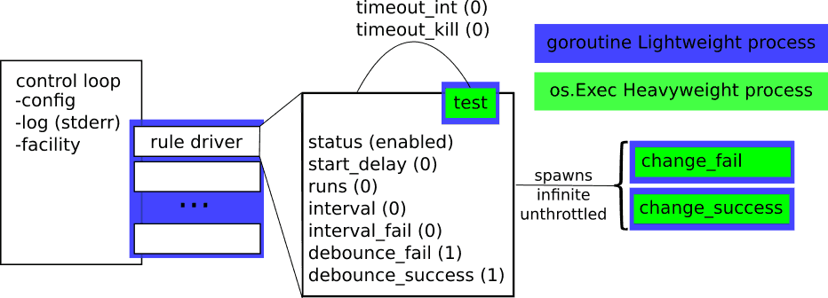

# hfm (High Frequency Monitor)

hfm is an application to run tests in parallel at a high frequency. If the
outcome of the test results in a state change, other commands can be executed.

It is designed to be a general purpose, loosely-coupled tool, by having both
the tests and the state change commands be executed by the operating system.
For example, one could write the test in shell or c, and have it called through
the exec facility.

In practice, the overhead of spawning a new process per test limits frequency
that can be achieved by the tests, and their results.  Anecdotally, 5ms
intervals have been seen to be achievable.

An example application is to poll other network services for health, and to
take actions based on their health status changes.

## Design

hfm is not currently a real-time monitor.

Scheduling is managed using Go's time.Sleep, which currently only guarantees it
"pauses the current goroutine for at least the duration d".  Therefore tests
will run by "at least" the interval you specify.  Scheduling in this way
ensures that we are not creating a backlog (or flood) of tests, should a test
execute for longer than the specified interval.

This may give a false confidence about any statistics that are generated by the
system, due to Coordinated Omission.

## Architecture

The control loop spawns one rule driver per rule.  The driver takes care of all
of the bookkeeping of the rule for its lifetime.  Each test is run as a 
heavyweight OS process, which can limit the actual frequency that tests can run
at.  Additionally, the state change commands are run as a heavyweight OS
process, and are just spawned at the rate they are needed.  High-frequency
state changes may become a problem, as the spawn rate is not throttled, nor are
these child processes monitored.  [Debouncing](https://en.wikipedia.org/wiki/Debounce#Contact_bounce)
the state change may help to alleviate this.

## Building

There's a patch-local-go-libucl make target that will allow you to use the
locally installed libucl vs. a vendorized version.

# Configuration

## Definitions

### Rule
Is a test, and all of the scheduling and other meta-data that goes with the
test

### Run
Is a single invocation of a test, and the related housekeeping (for example,
state change invocations)

### Interval
Is a time period, measured in seconds by default.  See
[Time Multipliers](https://github.com/vstakhov/libucl#convenient-numbers-and-booleans>)

## Configuration Format

hfm uses libucl for its configuration, this allows a great amount of flexibility
in the supported configuration syntax.

### Layout

At the most complicated, there are two supported levels of grouping and
inheritance available:

	global
	group {
		test {
		}
	}

A test could reside at any level of nesting, each is valid:

	test="true"

.

	test1 {
		test="true"
	}

.

	group1 {
		test1 {
			test="true"
		}
	}

If a test is found at a depth, no child configurations are traversed:

	group1 {
		test="true"
		test1 {
			test="won't get here"
		}
	}

Inheritable settings are passed down, closest to the test first:

	interval=1s
	group1 {
		interval=2s
		test1 {
			test="true"
		}
	}
	test2 {
			test="true"
	}

test1 would run every 2 seconds, while test2 would run every second.

### Configuration Values

#### status (inheritable, enum, default: enabled)
What the status of the rule is:

- enabled  - This rule's test will run at the scheduled interval, the
  change\_fail or change\_success command will execute normally.

- disabled - This rule's test will not run.  In fact, the rule will never be
  scheduled.  It might come in handy to disable polling of a group of tests at
  a time, for example.

- always-fail - This rule's test will run at the scheduled interval, regardless
  of the outcome, the change\_fail will execute each run.

- always-success - This rule's test will run at the scheduled interval,
  regardless of the outcome, the change\_success will execute every time.

#### test (string)
The command to execute to preform a test.  The command must give an exit code
not equal to 0 to indicate failure.

#### test\_arguments (string, array of strings)
Any parameters to pass to the test command as an argument.  An example
combination may be to run a config-file only shell command:

	test="/bin/sh"
	test_arguments=["-c", "true; if $?; then false; fi" ]

#### start\_delay (inheritable, interval, default: 0)
Delay the initial run of this test by start\_delay.  This may help stagger the
load of the tests.

#### interval (inheritable, interval, default: 0)
Interval to delay between subsequent starts of successful tests.  A value of 0
means to run the next test immediately after execution of the current test.

#### interval\_fail (inheritable, interval, default: interval)
Interval to delay between subsequent starts of a test after a failed test.  A
value of 0 means to run the next test immediately after execution of the
current test.  This allows one to configure hfm to run failed tests less (or
more) aggressively than successful tests.

#### timeout\_int (inheritable, interval, default: 0)
The amount of time the test process is allowed to run before sending a SIGINT
signal.  A value of 0 means a signal will not be sent.

#### timeout\_kill (inheritable, interval, default: 0)
The amount of time the test process is allowed to run before sending a SIGKILL
signal.  A value of 0 means a signal will not be sent.

#### change\_success (string)
The command to execute to preform a when a previously failed (or unrun) test
returns a success.

#### change\_success\_debounce (inheritable, default: 1)
The number of test runs that need to return successful from a previously failed
run, before change\_success is run.  A value of 1 means that change\_success will
run immediately.

#### change\_success\_arguments (string, array of strings)
Any parameters to pass to the change\_success command as an argument.  An
example combination may be to run a config-file only shell command:

	change_success="/bin/sh"
	change_success_arguments=["-c", "true; if $?; then false; fi" ]

#### change\_fail (string)
The command to execute to preform a when a previously successful (or unrun)
test returns a failure.

#### change\_fail\_debounce (inheritable, default: 1)
The number of test runs that need to return failure from a previously
successful run, before change\_fail is run.  A value of 1 means that change\_fail
will run immediately.

#### change\_fail\_arguments (string, array of strings)
Any parameters to pass to the change\_fail command as an argument.  An example
combination may be to run a config-file only shell command:

	change_fail="/bin/sh"
	change_fail_arguments=["-c", "true; if $?; then false; fi" ]

